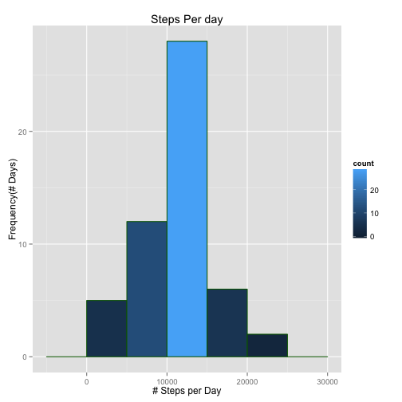
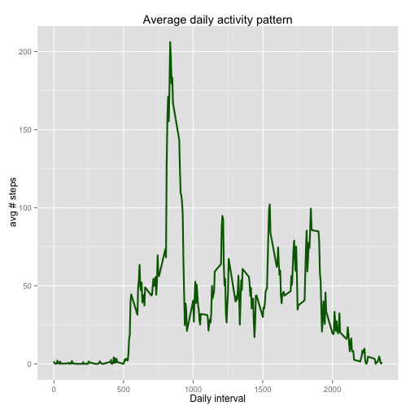
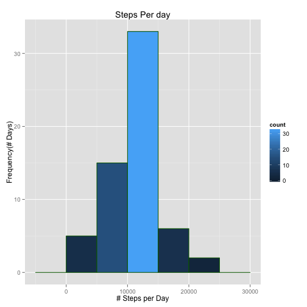
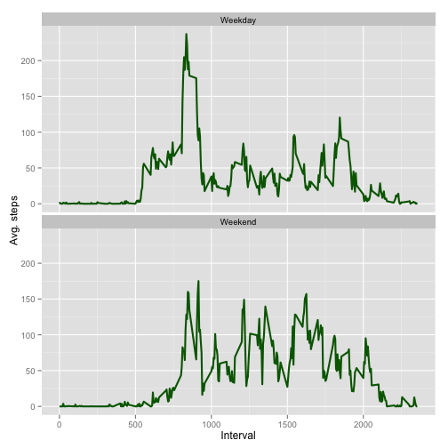

###### Knitted using R Studio 0.98.1087 on OS X 10.9.5
###### Hosted on [GitHub][1]
###### Publish on [Rpub][5]

## Abstract
Coursera reproducible research first peer assesment assignment repot using **R markdown** and processed with knitr.

The report assumes that the zip file already exist in local directory (As it existed in forked branch) and will not try to download it. To avoid encumbering the code with other safe guards it is also assumed that all required packages are installed.

The report follows closely the questions asked in the assignment, and therefore does not require more elaboration.

## Preparation
### Required packages

```r
library(knitr);
library(ggplot2)
```

### Loading The Data
Load Activities from local zipped data file. 
The original data file is hosted in the [cloudfront][1].

```r
unzip("activity.zip")
activity <- read.csv( "activity.csv", na.strings="NA", 
                      colClasses=c("numeric", "character", "numeric"))
```

### Preprocessing 

```r
activity$date <- as.Date(activity$date)  # String to date
```

Post processed activity table excerpt

```
##     steps       date interval
## 285    NA 2012-10-01     2340
## 286    NA 2012-10-01     2345
## 287    NA 2012-10-01     2350
## 288    NA 2012-10-01     2355
## 289     0 2012-10-02        0
## 290     0 2012-10-02        5
## 291     0 2012-10-02       10
## 292     0 2012-10-02       15
## 293     0 2012-10-02       20
## 294     0 2012-10-02       25
```

## Assigment tasks
### What is mean total number of steps taken per day?
#### 1. Make a histogram of the total number of steps taken each day

```r
steps.per.day <- aggregate(steps ~ date, activity, sum,    na.action = na.omit)

ggplot(steps.per.day, aes(x = steps)) + 
       geom_histogram(aes(fill = ..count..), colour = "darkgreen", binwidth = 5000) + 
        labs(title="Steps Per day", x = "# Steps per Day", y = "Frequency(# Days)")
```

 

#### 2. Calculate and report the mean and median total number of steps taken per day 

```r
mean.steps   <- round(mean(steps.per.day$steps, na.rm=TRUE), 2)
median.steps <- round(median(steps.per.day$steps, na.rm=TRUE), 2)
```
The total number of steps mean is ``10766.19`` 
and the median is ``10765``


### What is the average daily activity pattern?
#### 1. Make a time series of the 5-minute interval and the average (across all days) number of steps taken.

```r
avg.daily.steps.per.interval <- aggregate(activity["steps"], 
                                by = list(interval = activity$interval), FUN=mean, na.rm=TRUE)

ggplot(avg.daily.steps.per.interval, aes(x=interval, y=steps)) +   
        geom_line(color="darkgreen", size=1) +  
        labs(title="Average daily activity pattern", x="Daily interval", y=" avg # steps") 
```

 

####  2. Which 5-minute interval, on average across all the days in the dataset, contains the maximum number of steps?

```r
daily.interval.max.steps <- avg.daily.steps.per.interval[which.max(avg.daily.steps.per.interval$steps),]$interval
```
The daily average activity maxed on the 5 min interval starting at ``08:35`` averaging  ``206`` steps

### Imputing missing values
#### 1. Calculate and report the total number of missing values in the dataset 

```r
missing.values <- sum(is.na(activity$steps))
num.dates.missing.value <- length(unique(activity[is.na(activity$steps),"date"]))
num.wdays.missing.value <- length(unique(weekdays(as.Date(unique(activity[is.na(activity$steps),"date"])))))
```

There are ``2304`` missing values 
for ``8`` whole dates 
and for ``6`` distinct weekdays.

#### 2. Devise a strategy for filling in all of the missing values in the dataset
After checking how many measures each of the weekdays has

```r
table(weekdays(as.Date(unique(activity$date))))
```

```
## 
##    Friday    Monday  Saturday    Sunday  Thursday   Tuesday Wednesday 
##         9         9         8         8         9         9         9
```
And verifying how many measurements each weekday is missing.

```r
table(weekdays(as.Date(unique(activity[is.na(activity$steps),"date"]))))
```

```
## 
##    Friday    Monday  Saturday    Sunday  Thursday Wednesday 
##         2         2         1         1         1         1
```
It seems fairly reasonable that we can use the activity mean for that day of week for each interval to fill the missing values. We could have used the median, but the median is likely to change our previous averaged observation, so for lack of any other obligations and in an effortto limit the impact on previous work the mean is used.

#### 3. Create a new dataset that is equal to original but without missing data.
We will first create a reference data.frame with reference values as decribed in previous section. Each weekday, interval pair will be assigned the average of steps for that weekday as depicted by the entire dataset (missing values ignored)

```r
ref <-aggregate(activity["steps"], by = list(wday = weekdays(activity$date), 
                                        interval = activity$interval), 
                FUN=mean, na.rm=TRUE)
```
Now having the reference values for each weekday, interval pair, we iterate each of 
the rows of the activity data.frame and replace missing values from the reference
data.frame. 

```r
activity$steps <- mapply(function(steps, wday, interval) {
              ifelse( is.na(steps),  
                      ref[ref$wday == wday & ref$interval == interval, "steps"],
                      steps) },
              activity$steps, weekdays(activity$date), activity$interval)
```

#### 4. Make a histogram of the total number of steps taken each day and Calculate and report the *mean* and *median* total number of steps taken per day. 
Executing the same code as [above][3] for data.frame with no missing values yields 
the following histogram

```r
steps.per.day <- aggregate(steps ~ date, activity, sum,    na.action = na.omit)

ggplot(steps.per.day, aes(x = steps)) + 
       geom_histogram(aes(fill = ..count..), colour = "darkgreen", binwidth = 5000) + 
        labs(title="Steps Per day", x = "# Steps per Day", y = "Frequency(# Days)")
```

 
 

```r
mean.steps   <- round(mean(steps.per.day$steps, na.rm=TRUE), 2)
median.steps <- round(median(steps.per.day$steps, na.rm=TRUE), 2)
```
and [calculating the mean and median as above][4] gives ``10821.21`` 
and ``11015`` respectivly

As we can see the impact is minimal, The diagarm for that granularity stayed visibly the same and the mean and median has slightly altered. Replacing missing values with the median (Which some may argue is more reflective of the probable behavior), will impact the results much more drastically.

### Are there differences in activity patterns between weekdays and weekends?

#### 1. Create a new factor variable in the dataset with two levels – “weekday” and “weekend” indicating whether a given date is a weekday or weekend day.

```r
activity$type <- factor(ifelse (weekdays(activity$date) %in%  c("Saturday","Sunday"),
                                "Weekend", "Weekday"))
```


#### 2. Make a panel plot containing a time series plot of the 5-minute interval and the average number of steps taken, averaged across all weekday days or weekend days.

```r
steps.pattern.by.type <- aggregate(steps ~ interval + type, activity, mean, na.action = na.omit)

ggplot(steps.pattern.by.type, aes(x=interval, y=steps)) + 
       geom_line(color="darkgreen", size=1) + facet_wrap(~ type, nrow=2, ncol=1) +
       labs(x="Interval", y="Avg. steps") 
```

 

## Conclusion
We can see it last diagram that the weekly activity tend to be more spread, while weekday activities are peaking early morning, probably due to preparation for work day and tends to rise a bit after the work day. When activity during weekday is ebb after 20:00, during weekend activity is still high for an hour longer.


[1]: https://github.com/perplexedpigmy/RepData_PeerAssessment1
[2]: https://d396qusza40orc.cloudfront.net/repdata%2Fdata%2Factivity.zip
[3]: #make-a-histogram-of-the-total-number-of-steps-taken-each-day
[4]: #calculate-and-report-the-mean-and-median-total-number-of-steps-taken-per-day
[5]: http://rpubs.com/perplexedpigmy/53446
